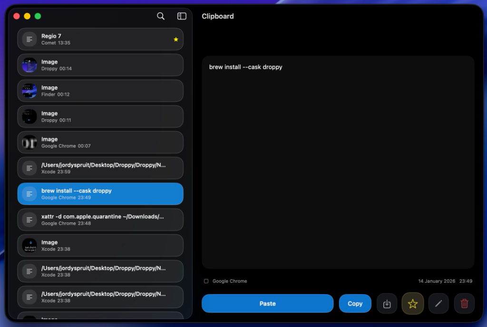
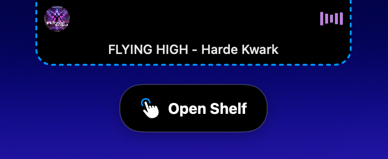

<p align="center">
  
</p>

<h1 align="center">Droppy</h1>

<p align="center">
  <strong>The native productivity layer macOS is missing.</strong><br>
  <em>Free, open-source, and built entirely in Swift.</em>
</p>

<p align="center">
    <a href="https://github.com/iordv/Droppy/releases/latest"></a>
    
    <a href="LICENSE"></a>
</p>

---

<p align="center">
  
</p>

<p align="center">
  <a href="https://iordv.github.io/Droppy/"><strong>🌐 Website</strong></a> · 
  <a href="https://github.com/iordv/Droppy/releases/latest"><strong>⬇️ Download</strong></a> · 
  <a href="https://iordv.github.io/Droppy/extensions.html"><strong>🧩 Extensions</strong></a>
</p>

---

## What is Droppy?

Stop juggling single-purpose utilities. Droppy brings your **clipboard history**, **file shelf**, **screenshot tools**, and **system HUDs** together in one native interface—all living inside your notch.

**No notch?** Droppy adds a Dynamic Island-style pill to any Mac.

---

## ✨ Clipboard Manager

Full history with search, favorites, OCR text extraction, and drag-out support.

<p align="center">
  
</p>

---

## 🎵 Media Controls

Album art, playback controls, and a seek slider—right in your notch.

<p align="center">
  
</p>

---

## 🎤 Voice Transcribe

Record and transcribe speech to text with 100% on-device AI. Your voice never leaves your Mac.

<p align="center">
  
</p>

---

## Everything Included

| Feature | Description |
|:---|:---|
| **File Shelf & Basket** | Drag files to the notch. Jiggle your mouse to summon a floating basket. |
| **Clipboard Manager** | Full history, search, favorites, OCR, drag-out |
| **Native HUDs** | Volume, brightness, battery, caps lock, unlock |
| **Media Controls** | Album art, seek slider, playback controls |
| **Window Snapping** | Snap to edges/corners with keyboard shortcuts |
| **Quick Actions** | Right-click to compress, convert, extract text, share |
| **Multi-Monitor** | Works on external displays with smart fullscreen detection |
| **Transparency Mode** | Optional glass effect for all windows |

---

## 🧩 Extensions

Droppy's built-in Extension Store adds powerful features on demand. Everything's free.

<p align="center">
  
</p>

**Featured:**

| | |
|:---|:---|
|  **Voice Transcribe** | On-device speech-to-text using WhisperKit AI |
|  **AI Background Removal** | Remove backgrounds locally using ML |
|  **Video Target Size** | Compress videos to exact file sizes with FFmpeg |
|  **Window Snap** | Snap windows with keyboard shortcuts |
|  **Spotify Integration** | Control Spotify playback from your notch |
|  **Element Capture** | Screenshot any UI element |
|  **Alfred Workflow** | Add files to Droppy from Alfred |
|  **Finder Services** | Right-click in Finder to send files to Droppy |

<p align="center">
  <a href="https://iordv.github.io/Droppy/extensions.html">
    
  </a>
</p>

---

## Install

### Homebrew (recommended)
```bash
brew install --cask iordv/tap/droppy
```

### Manual Download
1. Download [**Droppy.dmg**](https://github.com/iordv/Droppy/releases/latest)
2. Clear quarantine: `xattr -rd com.apple.quarantine ~/Downloads/Droppy-*.dmg`
3. Drag Droppy to Applications

---

## Keyboard Shortcuts

| Action | Shortcut |
|:---|:---|
| Open Clipboard | `⌘ + Shift + Space` |
| Navigate items | `↑` / `↓` |
| Paste selected | `Enter` |
| Close | `Escape` |

**Window Snapping** (with extension):

| Action | Shortcut |
|:---|:---|
| Snap left/right | `⌃ + ⌥ + ←/→` |
| Snap top/bottom | `⌃ + ⌥ + ↑/↓` |
| Maximize | `⌃ + ⌥ + Enter` |

---

## Requirements

- **macOS** 14.0 (Sonoma) or later
- **Architecture**: Apple Silicon (M1–M4) and Intel
- **Permissions**: Accessibility (required), Screen Recording (optional)

---

## FAQ

<details>
<summary><strong>Is Droppy really free?</strong></summary>
Yes! Free forever with no ads, subscriptions, or paywalls.
</details>

<details>
<summary><strong>Does it work on Macs without a notch?</strong></summary>
Absolutely. Droppy displays a Dynamic Island-style pill at the top of your screen.
</details>

<details>
<summary><strong>Is my data private?</strong></summary>
100%. All processing happens locally—clipboard history, voice transcription, and background removal never leave your Mac.
</details>

---

## Build from Source

```bash
git clone https://github.com/iordv/Droppy.git
cd Droppy && open Droppy.xcodeproj
# Build with ⌘ + R
```

---

## Support

<p align="center">
  <strong>Free forever — no ads, no subscriptions.</strong><br>
  If Droppy saves you time, consider buying me a coffee.
</p>

<p align="center">
  <a href="https://buymeacoffee.com/droppy">
    
  </a>
</p>

---

<p align="center">
  <strong><a href="LICENSE">GPL-3.0 + Commons Clause</a></strong> — Source available, not for resale.<br>
  <a href="TRADEMARK">Droppy™</a> by <a href="https://github.com/iordv">Jordy Spruit</a>
</p>
